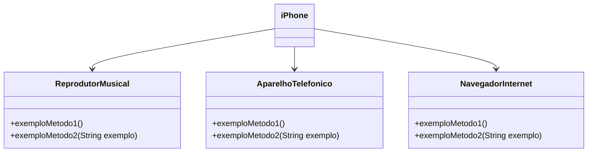

# [DIO](www.dio.me) - Desafio de Projeto POO

## Autores
- [Eduardo Berlatto](https://www.linkedin.com/in/eduardoberlatto/)

### Modelagem e Diagramação de um Componente iPhone
Foi proposto o seguinte desafio para colocar em prática todo o conteúdo apresentado no módulo de "Pilares da Programação Orientada a Objetos em Java":

Neste desafio, você será responsável por modelar e diagramar a representação UML do componente iPhone, abrangendo suas funcionalidades como Reprodutor Musical, Aparelho Telefônico e Navegador na Internet.

#### Contexto
Com base no vídeo de lançamento do iPhone de 2007 (link abaixo), você deve elaborar a diagramação das classes e interfaces utilizando uma ferramenta UML de sua preferência. Em seguida, implemente as classes e interfaces no formato de arquivos `.java`.

[Lançamento iPhone 2007](https://www.youtube.com/watch?v=9ou608QQRq8)
- Minutos relevantes: 00:15 até 00:55

#### Funcionalidades a Modelar
1. **Reprodutor Musical**
   - Métodos: `tocar()`, `pausar()`, `selecionarMusica(String musica)`
2. **Aparelho Telefônico**
   - Métodos: `ligar(String numero)`, `atender()`, `iniciarCorreioVoz()`
3. **Navegador na Internet**
   - Métodos: `exibirPagina(String url)`, `adicionarNovaAba()`, `atualizarPagina()`

### Objetivo
1. Criar um diagrama UML que represente as funcionalidades descritas acima.
2. Implementar as classes e interfaces correspondentes em Java (Opcional).

### Exemplo de Diagrama UML (Mermaid)

## Conclusão (por [Eduardo Berlatto](https://www.linkedin.com/in/eduardoberlatto/))

Seguindo o escopo acima proposto, concluí com êxito o desafio de projeto no qual foi criado o diagrama UML(arquivo "DiagramaDesafioJavaBasicoDIO.drawio.png") e também implementado em Java o cenário anteriormente criado em UML.